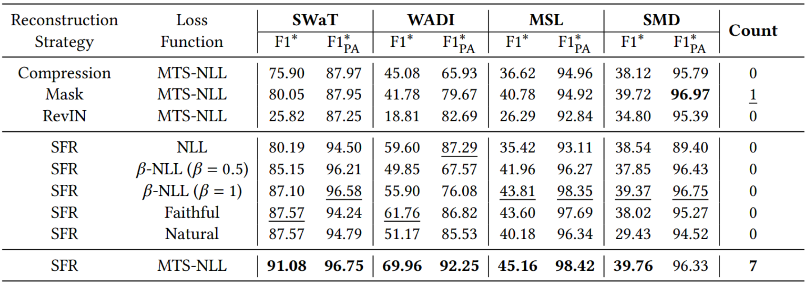
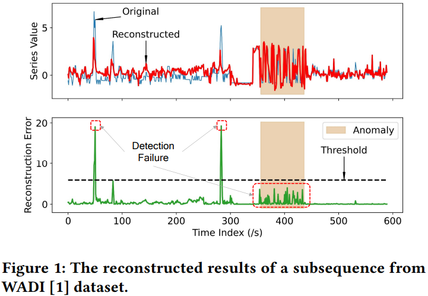
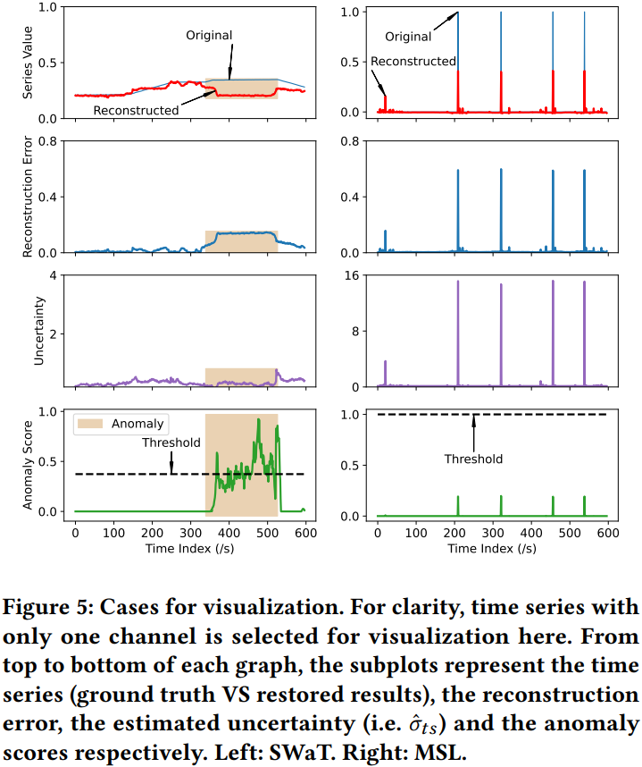
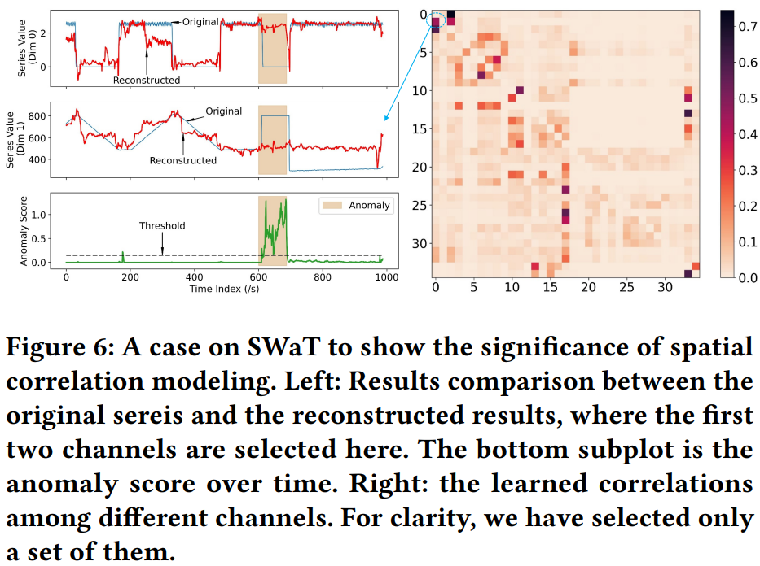

# SensitiveHUE (Under Review)
In this paper, we aim to enhance the sensitivity towards normal patterns through:
- Statistical Feature Removal to improve the dependency sensitivity.
- MTS-NLL loss function for effective heterogeneous uncertainty estimation, thereby incorporating sensitivity towards aleatoric uncertainty in multivariate time series (MTS).


# Get Started
1. Install Python 3.11 and the required packages in `requirements.txt`.
2. Download the datasets. We have put the processed versions (downsample and convert to numpy format) of SWaT in the `data` folder. For the complete versions ('.csv') of SWaT and WADI, you can apply for them at [iTrust](https://itrust.sutd.edu.sg/itrust-labs_datasets/dataset_info/). SMD and MSL are available at [TranAD](https://github.com/imperial-qore/TranAD/tree/main/data).
3. Train or evaluate the model. For example, to train the model on SWaT:
```
python main.py --config_path ./config/star.yaml --data_name SWaT
```

**Note**:
- our algorithm evaluates the performance only after the training phase.
- we have added one of the experimental results on SWaT into `sensitive_hue/model_states/SWaT/log_SensitiveHUE.txt`.

# Main Results
## 1. Overall Results
We use F1 with ($\text{F1}^*_{PA}$) and without ($\text{F1}^*$) point adjustment as the evaluation metrics (The Precision and Recall are obtained before point adjustment).


The detailed results of Precision and Recall after point adjustment are also presented below.


## 2. Ablation study
The effectiveness of major components of our framework are presented below, including statistical feature removal (SFR) and MTS-NLL loss function.



The magnitude of reconstruction error fails to accurately reflect the level of abnormality present in data, as shown below.



Uncertainty estimation plays a crutial role in anomaly detection. For the figure below, the left subplot shows that the slight deviation from the true series may be anomalous (low uncertainty), while for the right subplot, clear errors of reconstruction are caused by normal fluctuations (high uncertainty).



Dependency modeling is critical for anomaly detection in MTS, like spatial correlations between different channels. The figure below shows a case from SWaT dataset, where the right subplot presents the correlation matrix of a part of channels, and the left is an anomalous case relevant to channel 0 and 1. The details of visiualization is presented in Appendix D.



Window size slightly affects the performance of our framework. When the window size is too small or too large, i.e., too little or too much information is preserved, it is unfavorable to learn the complex dependencies in MTS.


# Disruption Strategy
If you are interested in our disruption strategy in Table 1 and 2, please refer to the folder `rec_strategy`. You can run the following command to get the results of compression on SWaT dataset:
```
python main_rec_strategy.py --config_path ./config/star_compression.yaml --mask_mode none --data_name SWaT
```
